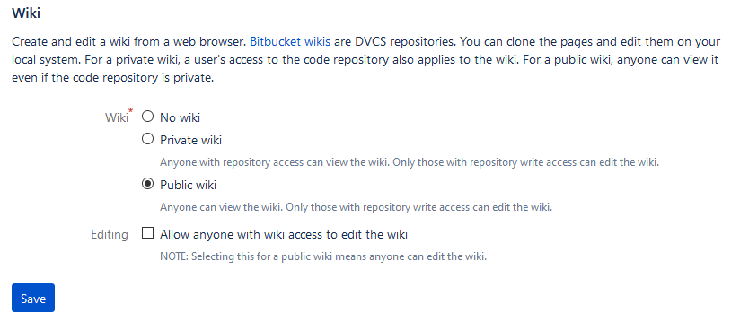
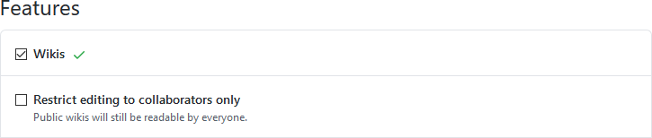
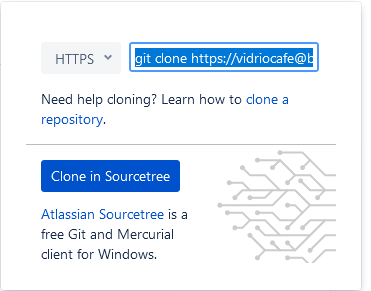
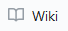
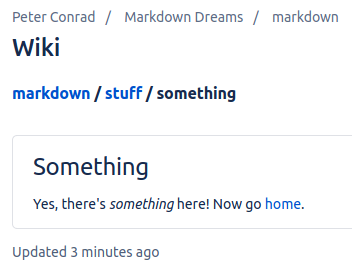

Edit a Git wiki
===============

** Does this work? Try it **

A Git repository comes with a wiki, where people can read and
collaboratively edit documentation. You can create a wiki to document
projects or code stored in the repository, or you can just use a
repository for its wiki capability.

!!! note A Git wiki is a second repository attached to your repository.
You clone, pull, and push to the main repository and the wiki
separately.

A Git wiki uses `Git wiki
structure <../../tools/tools-publishing#git-wiki-structure>`__ and it’s
one way to develop content for publishing in

Ingredients
-----------

.. raw:: html

   <table>

.. raw:: html

   <tr>

.. raw:: html

   <td>

Markdown editor

.. raw:: html

   </td>

.. raw:: html

   </tr>

.. raw:: html

   <tr>

.. raw:: html

   <td>

Git

.. raw:: html

   </td>

.. raw:: html

   </tr>

.. raw:: html

   </table>

Set up a wiki on your hosted repository
---------------------------------------

The easiest way to set up the wiki is by logging onto your Git host and
adding it there.

| === “Bitbucket and Sourcetree” 1. In a browser, log on to Bitbucket.
  1. Under “Repository settings” look for “Features” and click **Wiki**.
  1. Select **Public wiki** and save.
| |Wiki dialog|

=== “GitHub and GitHub Desktop” The GitHub documentation on
`Wikis <https://docs.gitlab.com/ee/user/project/wiki/>`__ is helpful.
Here are the basic steps:

1. In a browser, log on to GitHub.

   1. Click the **Settings** button:
      |Settings button|
   2. Scroll down to “Features” and select **Wikis**: |Features section
      of settings|

Edit content on the host
------------------------

If you just want to add a few pages to the wiki online, there’s no more
setup to do! Just go to your repository, click **Wiki**, and you’ll see
buttons for creating and editing pages.

!!! hint To add a page in a new folder, make the folder part of the new
filename. For example: ``morestuff/newpage.md`` adds ``newpage.md`` in a
folder called ``morestuff``.

Clone the wiki to a local repository
------------------------------------

There are advantages to working with wiki files locally, on your
computer:

-  It’s much easier to add folders and move files around
-  You can work on it even when you’re offline
-  You can use whatever Markdown editor you want
-  Others can collaborate with you

To work on the wiki locally, clone the wiki to a local repository:

| === “Bitbucket and Sourcetree” 1. Go to your online repository and
  click **Wiki**. 2. Click **Clone wiki** then **Clone in Sourcetree**.
| |Clone in Sourcetree button| 1. Make sure the local path shows the
  directory where you want to clone the repository, and click **Clone**.

| === “GitHub and GitHub Desktop” 1. Go to your online repository and
  click the **Wiki** button:
| |Wiki button| 1. Copy the **Clone this wiki locally** URL. 1. In
  GitHub Desktop, click **File > Clone repository**. 1. Paste the URL,
  make sure the local path shows the directory where you want to clone
  the repository, and click **Clone**.

| === “Linux command line” 1. Go to your online repository and click
  **Wiki**. 1. Copy the URL (or command and URL) to clone the wiki
  repository. 1. On the command line, navigate to the directory where
  you want to clone the repository. 1. Use ``git clone`` and the URL to
  clone the repository. Example:
| ``git clone https://my_name@bitbucket.org/my_name/markdown-stuff.git/wiki``

Work with the content locally
-----------------------------

On your computer, go to the directory where you cloned the wiki. There
should be a directory called ``wiki`` containing a file called
``Home.md`` containing the Markdown source for the welcome page the wiki
displayed when you created it online.

You can now work with the wiki using the `Git centralized
workflow <../../tools/tools-git-basics#centralized-workflow>`__ or the
`GitHub flow <../../tools/tools-git-basics#github-flow>`__, using the
familiar cycle of pull, edit, commit, push.

Tutorial
--------

Here’s a quick tutorial that shows how to organize pages in the wiki.

Try creating some content
~~~~~~~~~~~~~~~~~~~~~~~~~

Try making the following changes:

-  Add a folder called ``stuff``.
-  Using your favorite Markdown editor, make a file called
   ``something.md`` inside ``stuff``, with the following contents:

   ::

      # Something

      Yes, there's *something* here! Now go [home](../Home).

You should now have a directory structure that looks like this:

::

   Home.md
   stuff/
       something.md

Take a look
~~~~~~~~~~~

After you commit and push the changes, take a look in your online wiki:

1. Go to your online repository and click **Wiki**.
2. View the page tree of the wiki. For example:

   -  In Bitbucket, click the name of the wiki.
   -  In GitHub, click **Pages**.

3. Navigate to the page you created.
   |Screenshot of hte wiki page|
4. Try the ``home`` link.

Next steps
----------

Try the following recipe, which is very similar:

-  `Collaborate using the Git centralized
   workflow <../recipes-centralized-workflow/>`__

