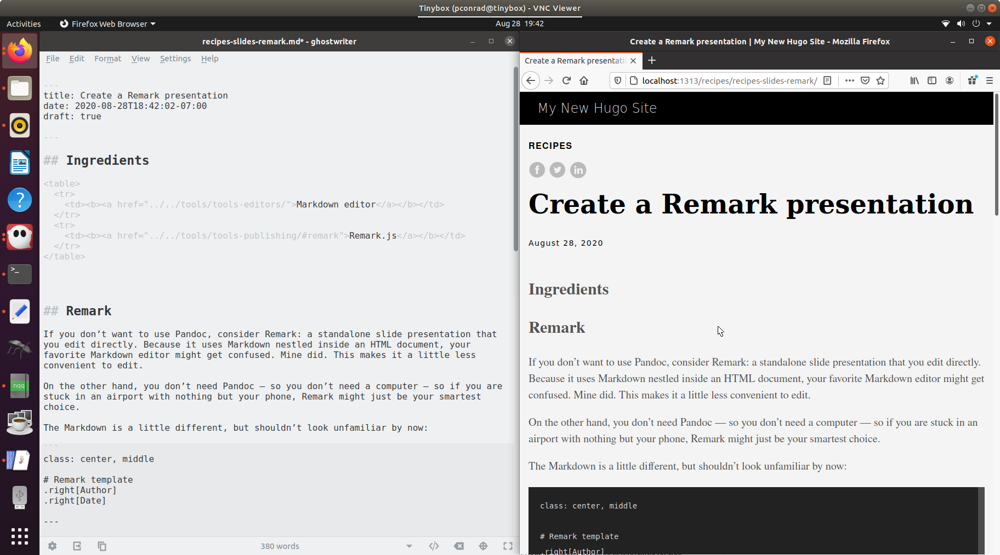

Publish a website with Hugo
===========================

https://github.com/fisodd/hugo-restructured

`Hugo <https://gohugo.io/>`__ is a very powerful open-source static site
generator that includes tools for organizing content, adding extensions,
and even creating dynamic logic. There is way too much to document here,
so the focus of this recipe will be getting started and a few basics.

To install Hugo, use your operating system’s package manager:

-  Linux: `apt-get <https://help.ubuntu.com/community/AptGet/Howto>`__
   or `yum <http://yum.baseurl.org/>`__
-  macOS: `Homebrew <https://brew.sh/>`__
-  Windows: `Chocolatey <https://chocolatey.org/>`__

Ingredients
-----------

.. raw:: html

   <table>

.. raw:: html

   <tr>

.. raw:: html

   <td>

reStructuredText editor

.. raw:: html

   </td>

.. raw:: html

   </tr>

.. raw:: html

   <tr>

.. raw:: html

   <td>

Hugo

.. raw:: html

   </td>

.. raw:: html

   </tr>

.. raw:: html

   <tr>

.. raw:: html

   <td>

Git (optional)

.. raw:: html

   </td>

.. raw:: html

   </tr>

.. raw:: html

   </table>

!!! hint Hugo works best with reStructuredText files that are organized in `Git
wiki structure <../../tools/tools-publishing#git-wiki-structure>`__. You
can even use `Git wiki <../recipes-git-wiki/>`__ to develop the content,
so long as you add YAML frontmatter as you go.

This recipe goes well with:

-  `Centralized Git workflow <../recipes-centralized-workflow/>`__
-  `GitHub flow <../recipes-gitflow/>`__

Setting up your site
--------------------

Once Hugo is installed, you can create a new site by typing
``hugo new site my-project``, which provides some instructions when it
runs:

::

   $ hugo new site my-project
   Congratulations! Your new Hugo site is created in /home/pconrad/git/my-project.

   Just a few more steps and you're ready to go:

   1. Download a theme into the same-named folder.
      Choose a theme from https://themes.gohugo.io/ or
      create your own with the "hugo new theme <THEMENAME>" command.
   2. Perhaps you want to add some content. You can add single files
      with "hugo new <SECTIONNAME>/<FILENAME>.<FORMAT>".
   3. Start the built-in live server via "hugo server".

   Visit https://gohugo.io/ for quickstart guide and full documentation.

!!! Hint For source control and collaboration, create the project in a
Git repo.

Adding a theme
--------------

To add a theme, you use the ``git submodule add`` command from within
your site directory. Each theme in Hugo’s official `Complete
List <https://themes.gohugo.io/>`__ includes instructions for adding the
submodule from the correct Git repository. Example:

::

   $ git submodule add https://github.com/budparr/gohugo-theme-ananke.git themes/ananke
   Cloning into '/home/pconrad/git/my-project/themes/ananke'...
   remote: Enumerating objects: 8, done.
   remote: Counting objects: 100% (8/8), done.
   remote: Compressing objects: 100% (8/8), done.
   remote: Total 1839 (delta 2), reused 1 (delta 0), pack-reused 1831
   Receiving objects: 100% (1839/1839), 4.33 MiB | 1.26 MiB/s, done.
   Resolving deltas: 100% (1022/1022), done.

After you’ve installed the theme, add it to the configuration file
``config.toml``. Example:

::

   $ echo 'theme = "ananke"' >> config.toml

Edit the ``config.toml`` file to change other things about the site,
such as the site title or the base URL.

Working with content
--------------------

You can create a new page with ``hugo new <path>``. For example, to
create a new post in the ``posts`` directory, type:

::

   hugo new posts/my-first-post.md

When it’s created, all this page contains is YAML frontmatter:

::

   ---
   title: "My First Post"
   date: 2020-08-28T18:42:02-07:00
   draft: true
   ---

You must add reStructuredText content before you can preview the page. A page in
Hugo must contain both frontmatter and reStructuredText content. If either is
missing, the page shows ``404 page not found`` when you try to preview
it.

Frontmatter can signal content status, including publish and expiry
dates, and can contain variables. You can use the variables in templates
and in content by creating your own Hugo shortcodes. Variables and
shortcodes are outside the scope of this recipe, but the Hugo website
has a lot of documentation.

If you are migrating content into Hugo from a Git wiki, MkDocs site, or
some other source, you will need to add frontmatter to any pages that
don’t already have it.

Local preview
-------------

To preview your content, start the Hugo server:

::

   $ hugo server -D

The ``-D`` option tells Hugo to include draft pages in the preview. If
you omit this option, any page with ``draft:true`` in the frontmatter is
ignored.

   Screenshot of Hugo live preview

Hugo is a bit finicky about previewing and building content, and there
are a few reasons why pages might not show up in the preview. A first
troubleshooting step is to make sure each file contains both frontmatter
and reStructuredText, and that it doesn’t have a publish date in the future or
expiry date in the past.

Images
~~~~~~

Images in Hugo normally go in the ``static`` directory. Here, I’ve added
a subdirectory called ``images`` and when I add the image in my reStructuredText
editor it looks like this:

.. figure:: ../../static/images/whatever.png
   :alt: An image

   An image

That makes sense, since that is the correct relative path to the file.
When the site is built for local preview, however, the result is this:

Unfortunately, that won’t work. The actual relative path to the image
is: ``../../images/whatever.png`` instead.

In other words, when you add an image whose relative path is correct
with regard to the reStructuredText file, you must remove ``static/`` from the
path to make it work in the preview and the built site. If you are using
an editor that lets you preview the images as you work, then you have to
break all the images to get them to work in Hugo.

One solution might be to upload all your images to the web first, then
use absolute paths—but this will make it more difficult to move the
website or change the paths later.

Building and publishing
-----------------------

The ``hugo`` command builds the website in a directory called
``public``. To publish the site, use FTP to transfer the contents of
that directory to a folder on a webserver.

!!! hint To prevent Git from tracking changes to the ``public``
directory, create a file called ``.gitignore`` at the top level
directory of the Hugo project with the following contents:

``public/``

If you use ``git add`` to add your ``.gitignore`` file to change
tracking, then it will apply to anyone who clones the repo—meaning that
no one will add built HTML pages to Git.
