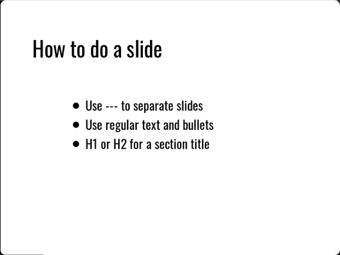
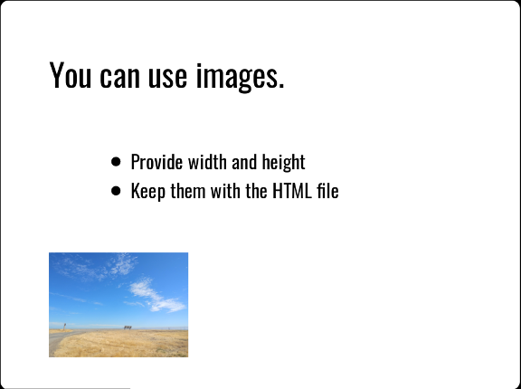

Create a DZSlides presentation
==============================

You can use Pandoc to create a standalone slide presentation in DZSlides
format, which is useful for presenting when you aren’t sure what
software will be available. DZSlides creates bold, attractive slides
that discourage the use of too much text.

Ingredients
-----------

.. raw:: html

   <table>

.. raw:: html

   <tr>

.. raw:: html

   <td>

Markdown editor

.. raw:: html

   </td>

.. raw:: html

   </tr>

.. raw:: html

   <tr>

.. raw:: html

   <td>

Pandoc

.. raw:: html

   </td>

.. raw:: html

   </tr>

.. raw:: html

   <tr>

.. raw:: html

   <td>

A browser

.. raw:: html

   </td>

.. raw:: html

   </tr>

.. raw:: html

   </table>

Markdown for DZSlides
---------------------

Start your Markdown file with YAML metadata or a simple block like this:

::

   % Title
   % Author Name
   % Date

DZSlides uses the horizontal rule (``---``) as a separator between
slides. A level one or level two heading is a section title.

Here’’s some sample Markdown:

::

   ---

   # H1 or H2 is a Section Title

   ---

   Normal Text or Slide Title

   - Bullet
   - Bullet

   ---

Normal text is big enough for a title or announcement on a slide.

   Screenshot of a DZSlides slide

The layout of slides in DZslides is simple; you probably won’’t find
yourself using tables or columns a lot.

Images
~~~~~~

When your Markdown includes images, use relative paths. For example:

::

   

In the above example, the ``images`` directory is at the same level as
the file containing the Markdown file; the relative path goes up a
directory from the Markdown file and then down into the ``images``
directory to find the image.

When Pandoc follows these relative links, it starts from the directory
where you typed the ``pandoc`` command. If you want Pandoc to find your
images, either run the command from a directory where the relative links
to the images make sense, or copy the images to a place where the
relative links can find them.

After you create the presentation, which is an HTML file, you need to
keep the images and the presentation together. If you copy your
presentation to a thumb drive without the images, the images won’t work.

!!! hint It’’s a good idea to create the Markdown presentation in a
folder with all the images it needs, then use Pandoc to build the
presentation in the same folder. You can copy the entire folder wherever
you need it, knowing that all the images for the presentation will work.

Pandoc provides syntax for scaling an image:

::

   {width=25%}

   Screenshot of another DZSlides slide

When Pandoc renders the image, it is scaled to a percentage of the
container where it resides (the slide, in most cases). The alt text is
used for a caption.

Creating the presentation
-------------------------

The command for creating the document is simple. With a single Markdown
file, it looks like this:

::

   pandoc -t dzslides -s myslides.md -o myslides.htm

The ``-s`` option tells Pandoc to create a standalone presentation,
including all the CSS, HTML, and JavaScript needed to display it. You
can view the presentation by opening the resulting HTML file in a
browser.

Next steps
----------

-  Check out the `DZSlides
   template <../../resources/templates/#dzslides>`__
