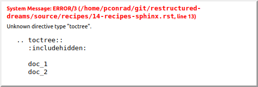

Build docs with Sphinx
======================

Every page needs a title! And must be in a toctree, all or nothing

Originally, Sphinx was conceived for a single project, the documentation of the Python language. Shortly afterwards, it was made available for everyone as a documentation tool, but the documentation of Python modules remained deeply built in ? the most fundamental directives, like function, were designed for Python objects. Since Sphinx has become somewhat popular, interest developed in using it for many different purposes: C/C++ projects, JavaScript, or even reStructuredText markup (like in this documentation).

While this was always possible, it is now much easier to easily support documentation of projects using different programming languages or even ones not supported by the main Sphinx distribution, by providing a domain for every such purpose.

A domain is a collection of markup (reStructuredText directives and roles) to describe and link to objects belonging together, e.g. elements of a programming language. Directive and role names in a domain have names like domain:name, e.g. py:function. Domains can also provide custom indices (like the Python Module Index).

Having domains means that there are no naming problems when one set of documentation wants to refer to e.g. C++ and Python classes. It also means that extensions that support the documentation of whole new languages are much easier to write.

While Docutils provides a number of directives, Sphinx provides many more and uses directives as one of the primary extension mechanisms.

Since reST does not have facilities to interconnect several documents, or split documents into multiple output files, Sphinx uses a custom directive to add relations between the single files the documentation is made of, as well as tables of contents. The toctree directive is the central element.

* The goal of this document is to give you a quick taste of what Sphinx is and how you might use it. When you?re done here, you can check out the installation guide followed by the intro to the default markup format used by Sphinx, reStucturedText.

https://www.sphinx-doc.org/en/master/usage/quickstart.html#setting-up-the-documentation-sources

* Sphinx comes with a script called sphinx-quickstart that sets up a source directory and creates a default conf.py with the most useful configuration values from a few questions it asks you. To use this, run:

::

    $ sphinx-quickstart

.. Note:: Just do quickstart. Then you get the make file.

Let?s assume you?ve run sphinx-quickstart. It created a source directory with conf.py and a master document, index.rst. The main function of the master document is to serve as a welcome page, and to contain the root of the ?table of contents tree? (or toctree). This is one of the main things that Sphinx adds to reStructuredText, a way to connect multiple files to a single hierarchy of documents.

The next thing you should do is set up the folders yo uwant with some index files in them and start figuring out the structure of the content. Then you want to deal with the TOC.

Dealing with the TOC
--------------------

Sphinx has this TOC thing. Unline Git Wiki format, if you want a folder, it's a parent page (like Confluence) not just a folder (like Git Wiki). So you have a couple choices:

* Everything is flat, with a TOC on the index page
* Everthing's in folders but the navigation is flat
* Nice hierarchical navigation

The way I found to do that last one is to put things in folders, then every folder gets an `index.rst` page. Because it's really a page, you need some content there. 

On the top level index.rst, you include whatever top-level pages you want, including the indexes in the folders:

::

    .. toctree::
       :includehidden:
    
       02-getting-started
       tools/index
       recipes/index
       resources/index

Then on each index in a folder, you do this:

::

    .. toctree::
       :hidden:
    
       22-restructuredtext-cheatsheet
       23-templates
       24-resources-glossary
       25-links

Finally, on those leaf pages, you do this:

::

    .. toctree::
       :hidden:

If you don't put a `.. toctree::` on every damn page, then your left nav goes bonkers when you hit a page without one. And you get a build warning too:

::

    /home/pconrad/git/restructured-dreams/source/recipes/index.rst:4: WARNING: toctree contains reference to document 'recipes/19-recipes-slides' that doesn't have a title: no link will be generated

Also don't forget that not all editors (based on DocUtils) understand the Sphinx directives, so you'll get this:

But if you do it right, you get this nice expanding/collapsing nav:

.. image:: ../../img/sphinx-website-nav.png

Pick a theme
------------

https://www.sphinx-doc.org/en/master/usage/theming.html

Some themes aer built in. Go look at https://www.sphinx-doc.org to find a list and then just change the `html_theme` parameter in `source/conf.py`

You can also set theme-specific options using the html_theme_options config value. These options are generally used to change the look and feel of the theme.

See https://www.sphinx-doc.org/en/master/usage/configuration.html#confval-html_theme_options

You can use non-built-in themes

If the theme does not come with Sphinx, it can be in two static forms or as a Python package. For the static forms, either a directory (containing theme.conf and other needed files), or a zip file with the same contents is supported. The directory or zipfile must be put where Sphinx can find it; for this there is the config value html_theme_path. This can be a list of directories, relative to the directory containing conf.py, that can contain theme directories or zip files. For example, if you have a theme in the file blue.zip, you can put it right in the directory containing conf.py and use this configuration:

html_theme = "blue"
html_theme_path = ["."]

The third form is a Python package. If a theme you want to use is distributed as a Python package, you can use it after installing

# installing theme package
$ pip install sphinxjp.themes.dotted

Once installed, this can be used in the same manner as a directory or zipfile-based theme:

html_theme = "dotted"

Doing a build 
--------------

::

    $ sphinx-build -b html source/ build/

::

    $ make html

Make targets
------------

::

    $ make
    Sphinx v3.2.1
    Please use `make target' where target is one of
      html        to make standalone HTML files
      dirhtml     to make HTML files named index.html in directories
      singlehtml  to make a single large HTML file
      pickle      to make pickle files
      json        to make JSON files
      htmlhelp    to make HTML files and an HTML help project
      qthelp      to make HTML files and a qthelp project
      devhelp     to make HTML files and a Devhelp project
      epub        to make an epub
      latex       to make LaTeX files, you can set PAPER=a4 or PAPER=letter
      latexpdf    to make LaTeX and PDF files (default pdflatex)
      latexpdfja  to make LaTeX files and run them through platex/dvipdfmx
      text        to make text files
      man         to make manual pages
      texinfo     to make Texinfo files
      info        to make Texinfo files and run them through makeinfo
      gettext     to make PO message catalogs
      changes     to make an overview of all changed/added/deprecated items
      xml         to make Docutils-native XML files
      pseudoxml   to make pseudoxml-XML files for display purposes
      linkcheck   to check all external links for integrity
      doctest     to run all doctests embedded in the documentation (if enabled)
      coverage    to run coverage check of the documentation (if enabled)

A build
-------

::

    $ make html
    Running Sphinx v3.2.1
    loading pickled environment... done
    building [mo]: targets for 0 po files that are out of date
    building [html]: targets for 1 source files that are out of date
    updating environment: 0 added, 9 changed, 0 removed
    reading sources... [100%] tools/07-tools-git-basics                             
    /home/pconrad/git/restructured-dreams/source/02.5-basics.rst:508: WARNING: Footnote [#] is not referenced.
    /home/pconrad/git/restructured-dreams/source/02.5-basics.rst:509: WARNING: Footnote [#] is not referenced.
    /home/pconrad/git/restructured-dreams/source/02.5-basics.rst:: WARNING: image file not readable: my-image.png
    /home/pconrad/git/restructured-dreams/source/02.5-basics.rst:411: WARNING: image file not readable: gnu.png(options)
    /home/pconrad/git/restructured-dreams/source/02.5-basics.rst:: WARNING: image file not readable: picture.png
    /home/pconrad/git/restructured-dreams/source/02.5-basics.rst:: WARNING: image file not readable: tent.png
    /home/pconrad/git/restructured-dreams/source/02.5-basics.rst:: WARNING: image file not readable: waves.png
    /home/pconrad/git/restructured-dreams/source/02.5-basics.rst:: WARNING: image file not readable: peak.png
    /home/pconrad/git/restructured-dreams/source/recipes/10-recipes-git-wiki.rst:197: WARNING: image file not readable: recipes/../img/recipes-git-wiki-create.png
    /home/pconrad/git/restructured-dreams/source/recipes/10-recipes-git-wiki.rst:198: WARNING: image file not readable: recipes/../img/github-settings.png
    /home/pconrad/git/restructured-dreams/source/recipes/10-recipes-git-wiki.rst:199: WARNING: image file not readable: recipes/../img/git-wikis.png
    /home/pconrad/git/restructured-dreams/source/recipes/10-recipes-git-wiki.rst:200: WARNING: image file not readable: recipes/../img/recipes-git-repo-bb-clone-wiki.png
    /home/pconrad/git/restructured-dreams/source/recipes/10-recipes-git-wiki.rst:201: WARNING: image file not readable: recipes/../img/github-wiki-button.png
    /home/pconrad/git/restructured-dreams/source/recipes/10-recipes-git-wiki.rst:202: WARNING: image file not readable: recipes/../img/recipes-git-wiki-bb-something.png
    /home/pconrad/git/restructured-dreams/source/recipes/11-recipes-centralized-workflow.rst:: WARNING: image file not readable: recipes/../img/git-centralized-workflow.png
    /home/pconrad/git/restructured-dreams/source/recipes/12-recipes-gitflow.rst:17: WARNING: image file not readable: recipes/../img/github-flow.png
    /home/pconrad/git/restructured-dreams/source/recipes/13-recipes-hugo.rst:199: WARNING: image file not readable: recipes/../img/hugo-preview.png
    /home/pconrad/git/restructured-dreams/source/recipes/13-recipes-hugo.rst:217: WARNING: image file not readable: recipes/../../static/images/whatever.png
    /home/pconrad/git/restructured-dreams/source/recipes/20-recipes-slides-dzslides.rst:110: WARNING: image file not readable: recipes/../img/slides-dzslides.png
    /home/pconrad/git/restructured-dreams/source/recipes/20-recipes-slides-dzslides.rst:153: WARNING: image file not readable: recipes/../img/slides-dzslides-images.png
    /home/pconrad/git/restructured-dreams/source/resources/22-restructuredtext-cheatsheet.rst:45: WARNING: image file not readable: path/to/image.jpg
    /home/pconrad/git/restructured-dreams/source/tools/07-tools-git-basics.rst:33: WARNING: image file not readable: tools/../img/git-centralized-workflow.png
    /home/pconrad/git/restructured-dreams/source/tools/07-tools-git-basics.rst:64: WARNING: image file not readable: tools/../img/github-flow.png
    looking for now-outdated files... none found
    pickling environment... done
    checking consistency... /home/pconrad/git/restructured-dreams/source/01-index.rst: WARNING: document isn't included in any toctree
    /home/pconrad/git/restructured-dreams/source/02.5-basics.rst: WARNING: document isn't included in any toctree
    /home/pconrad/git/restructured-dreams/source/rstest.rst: WARNING: document isn't included in any toctree
    done
    preparing documents... done
    writing output... [100%] tools/index                                            
    /home/pconrad/git/restructured-dreams/source/02.5-basics.rst:: WARNING: Could not obtain image size. :scale: option is ignored.
    /home/pconrad/git/restructured-dreams/source/recipes/index.rst:4: WARNING: toctree contains reference to document 'recipes/19-recipes-slides' that doesn't have a title: no link will be generated
    /home/pconrad/git/restructured-dreams/source/recipes/index.rst:4: WARNING: toctree contains reference to document 'recipes/19-recipes-slides' that doesn't have a title: no link will be generated
    /home/pconrad/git/restructured-dreams/source/recipes/index.rst:4: WARNING: toctree contains reference to document 'recipes/19-recipes-slides' that doesn't have a title: no link will be generated
    /home/pconrad/git/restructured-dreams/source/recipes/index.rst:4: WARNING: toctree contains reference to document 'recipes/19-recipes-slides' that doesn't have a title: no link will be generated
    /home/pconrad/git/restructured-dreams/source/recipes/index.rst:4: WARNING: toctree contains reference to document 'recipes/19-recipes-slides' that doesn't have a title: no link will be generated
    /home/pconrad/git/restructured-dreams/source/recipes/index.rst:4: WARNING: toctree contains reference to document 'recipes/19-recipes-slides' that doesn't have a title: no link will be generated
    /home/pconrad/git/restructured-dreams/source/recipes/index.rst:4: WARNING: toctree contains reference to document 'recipes/19-recipes-slides' that doesn't have a title: no link will be generated
    generating indices...  genindexdone
    writing additional pages...  searchdone
    copying static files... ... done
    copying extra files... done
    dumping search index in English (code: en)... done
    dumping object inventory... done
    build succeeded, 34 warnings.
    
    The HTML pages are in build/html.
