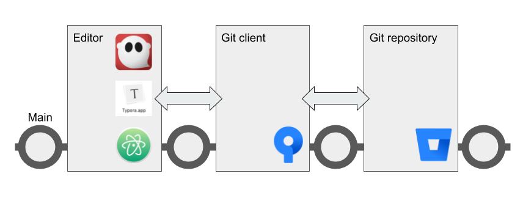

Collaborate using centralized Git workflow
==========================================

You can use Git to help a team collaborate on informal or internal
documents in a very simple way.

The centralized workflow can be an effective way for content creators,
managers, and engineers to collaborate on non-production content such as
specifications, planning documents, newsletters, internal documentation,
and the like.

In this workflow, everyone works on the same branch. This makes things
easy for simple collaboration.

.. Note::
   If you’re publishing a large website or documentation set in a production environment with with a substantial number of collaborators,you should consider using `GitHub Flow <../recipes-gitflow/>`__ instead.

Ingredients
-----------

* reStructuredText editor
* Git
* Sphinx or Pandoc

.. hint::
   Plan ahead based on the publishing tool you want to use. If you’re planning to use a wiki, MkDocs, or Hugo, organize your docs in `Git wiki structure <../../tools/tools-publishing#git-wiki-structure>`__ and add YAML frontmatter from the start. If you’re creating large documents with Pandoc, think about whether you need to work on content in pieces and then use Pandoc to assemble everything.

Working with content
--------------------

This recipe uses the centralized Git workflow. `Pick an
editor <tools-editors/>`__, then make sure you have Git set
up and try each step below. The steps work together like a heartbeat
that keeps content safe and synchronized for all collaborators.

.. Hint::
   If you use a code editor such as Atom, you can see the changes you'll need to commit as you edit your reStructuredText files.

1. `Pull <pull>`_
    Fetch the latest changes from the remote repository to the local repository on your computer
2. Work
    Edit your content in your favorite Markdown editor
3. `Stage and commit <stage-and-commit>`_
    From time to time, in your Git client, type a short sentence about what you've done and save the changes to Git
4. `Push <push>`_
     When your work is final, push it up to the remote repository

If you need to publish, you can use Sphinx to create a website or ePub book, or Pandoc to convert to other formats.

.. hint:: Remember not to publish content into a Git repository. The repo is only for storing your reStructuredText and other source files.

See also:

- :ref:`publishing-tools`
