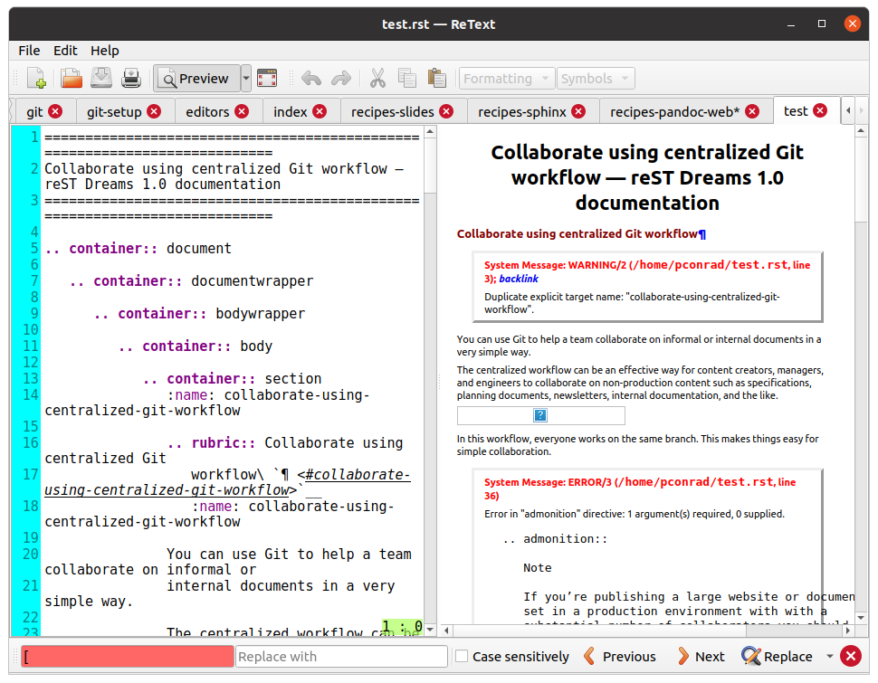

Grab a web page with Pandoc
===========================

Converting a web page to reStructuredText on the fly is a small task that can be
very helpful if you need to grab content for editing or add information
from the web to your notes.

::

    pandoc -s -r html https://www.example.com/index.html -t rst -o test.rst
    

The results are not always great. You might get errors. But at least you get plausible reST to start with. It can make it easier to get content into your existing docs.

