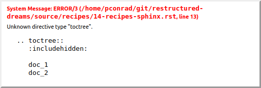
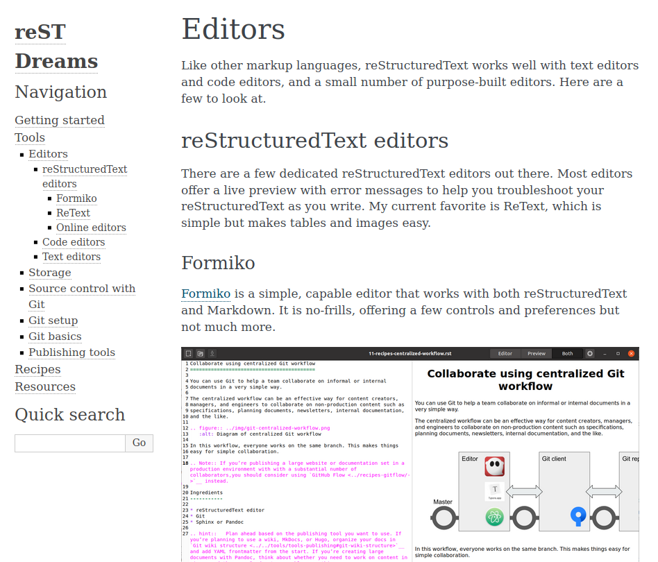
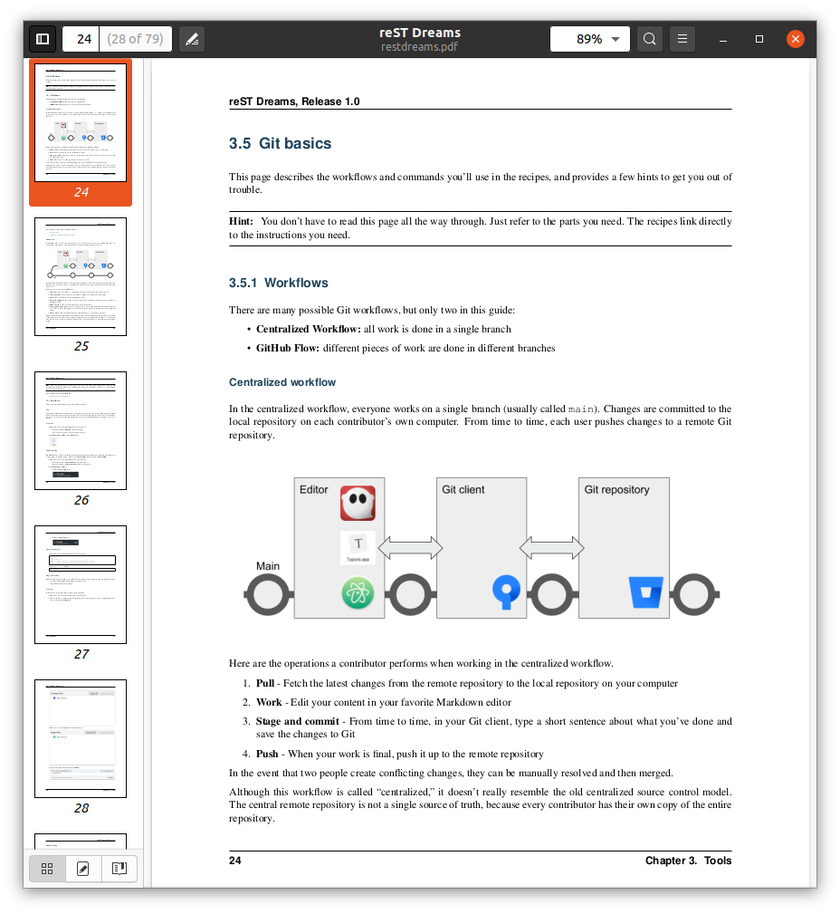
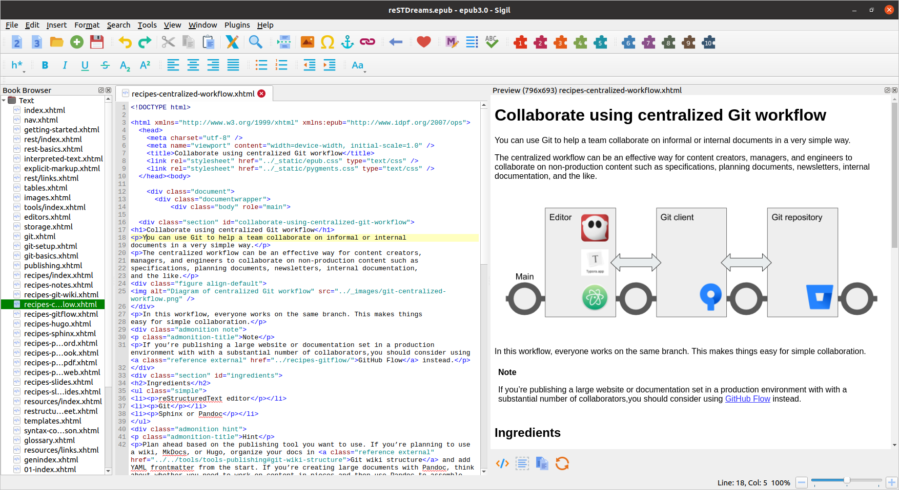

Build docs with Sphinx
======================

Sphinx is a Python-based documentation generator that builds websites, ePub books, PDFs, and other formats from reStructuredText or Markdown. Sphinx adds directives like ``toctree`, ``index``, and ``glossary`` to help manage a group of documents together as part of a larger whole. In particular, the ``toctree`` directive establishes relationships between files to build an overall documentation structure. The root  of the ``toctree`` lives in the top level ``index.rst`` file in your ``source`` directory.

After installing Sphinx (``pip install sphinx``), here's how to set up a project:

#. Run the script ``sphinx-quickstart`` which prompts you with a few questions to help you set up a project, including a ``source`` directory for your files and a basic version of the configuration file ``conf.py`` and a master document, your top-level ``index.rst``.
#. Create or copy files and directories containing your content. Organize it. TO DO write a doc about this.
#. You'll want an ``index.rst`` in every folder.
#. Figure out what to do about the TOC
#. Pick a theme.

A few things to know about reStructuredText and Sphinx:

- Every document must have a title heading.
- If you're going to use ``toctree``, you must use it on every file.
- 

https://thomas-cokelaer.info/tutorials/sphinx/quickstart.html

https://www.sphinx-doc.org/en/master/usage/quickstart.html#setting-up-the-documentation-sources

Managing the TOC tree
---------------------

Sphinx has this TOC thing. Unline Git Wiki format, if you want a folder, it's a parent page (like Confluence) not just a folder (like Git Wiki). So you have a couple choices:

* Everything is flat, with a TOC on the index page
* Everthing's in folders but the navigation is flat
* Nice hierarchical navigation

The way I found to do that last one is to put things in folders, then every folder gets an `index.rst` page. Because it's really a page, you need some content there. 

On the top level index.rst, you include whatever top-level pages you want, including the indexes in the folders:

::

    reStructured Dreams
    ===================
    
    .. toctree::
       :includehidden:
    
       getting-started
       rest/index
       tools/index
       recipes/index
       resources/index

Then on each index in a folder, you do this:

::

    Tools
    ================
    
    .. toctree::
       :hidden:
    
       editors
       storage
       git
       git-setup
       git-basics
       publishing

Finally, on those leaf pages, you do this:

::

    .. toctree::
       :hidden:

If you don't put a title and a `.. toctree::` on every damn page, then your left nav goes bonkers when you hit a page without one. And you get a build warning too:

::

    /home/pconrad/git/restructured-dreams/source/recipes/index.rst:4: WARNING: toctree contains reference to document 'recipes/sphinx' that doesn't have a title: no link will be generated

Also don't forget that not all editors (based on DocUtils) understand the Sphinx directives, so you'll get this:

But if you do it right, you get this nice expanding/collapsing nav:

Building HTML 
-------------------

``sphinx-quickstart`` createes you a ``Makefile`` so you can just do::

    make html

If you don't have the``Makefile`` for some reason, use::

    sphinx-build -b html source/ build/

It tells you what's wrong. Example:

::

    $ sphinx-build -b html source/ build/
    Running Sphinx v3.2.1
    loading pickled environment... done
    building [mo]: targets for 0 po files that are out of date
    building [html]: targets for 2 source files that are out of date
    updating environment: 1 added, 4 changed, 0 removed
    reading sources... [100%] tools/index                                                          
    /home/pconrad/git/restructured-dreams/source/recipes/13-recipes-hugo.rst:: WARNING: image file not readable: recipes/../../static/images/whatever.png
    /home/pconrad/git/restructured-dreams/source/resources/22-restructuredtext-cheatsheet.rst:45: WARNING: image file not readable: path/to/image.jpg
    looking for now-outdated files... none found
    pickling environment... done
    checking consistency... /home/pconrad/git/restructured-dreams/source/01-index.rst: WARNING: document isn't included in any toctree
    /home/pconrad/git/restructured-dreams/source/rstest.rst: WARNING: document isn't included in any toctree
    done
    preparing documents... done
    writing output... [100%] tools/index                                                           
    generating indices...  genindexdone
    writing additional pages...  searchdone
    copying images... [100%] recipes/../../img/hugo-preview.png                                    
    copying static files... ... done
    copying extra files... done
    dumping search index in English (code: en)... done
    dumping object inventory... done
    build succeeded, 4 warnings.
    
    The HTML pages are in build

Building a PDF
----------------

Add to ``conf.py``:

::

    # -- Options for LaTeX output -------------------------------------------------
    
    latex_show_pagerefs = True
    latex_show_urls = 'inline'

Made sure to install ``latexmk``::

   $ sudo apt-get install latexmk

Not sure how to get rid of section numbering.

You can do::

    make latexpdf

or

::

    sphinx-build -M latexpdf source/ build/

Building an ePub
----------------

::

    make epub

or

::
    sphinx-build -b epub source/ build/

Here's what it looks like opened in Sigil

Grab Sigil or epub related stuff from md-dreams

Themes
------------

https://www.sphinx-doc.org/en/master/usage/theming.html

Some themes aer built in. Go look at https://www.sphinx-doc.org to find a list and then just change the ``html_theme`` parameter in ``source/conf.py``

You can also set theme-specific options using the ``html_theme_options`` config value. These options are generally used to change the look and feel of the theme.

See https://www.sphinx-doc.org/en/master/usage/configuration.html#confval-html_theme_options

You can use non-built-in themes

If the theme does not come with Sphinx, it can be in two static forms or as a Python package. For the static forms, either a directory (containing theme.conf and other needed files), or a zip file with the same contents is supported. The directory or zipfile must be put where Sphinx can find it; for this there is the config value ``html_theme_path``. This can be a list of directories, relative to the directory containing ``conf.py``, that can contain theme directories or zip files. For example, if you have a theme in the file ``blue.zip``, you can put it right in the directory containing ``conf.py`` and use this configuration::

    html_theme = "blue"
    html_theme_path = ["."]

The third form is a Python package. If a theme you want to use is distributed as a Python package, you can use it after installing::

    # installing theme package
    $ pip install sphinxjp.themes.dotted

Once installed, this can be used in the same manner as a directory or zipfile-based theme::

    html_theme = "dotted"

Other capabilities
-----------------------

Indexing
^^^^^^^^^^^

Adding index terms to a paragraph in Sphinx looks like:

::

    .. index::
        single: Programming languages
        single: Compiling
        single: Source code

Cross-references
^^^^^^^^^^^^^^^^

If you want to link to other files, use ref
there's the general ``:ref:`` directive, documented here. They give this example:

::

    .. _my-reference-label:

    Section to cross-reference
    --------------------------

    This is the text of the section.

    It refers to the section itself, see :ref:`my-reference-label`.

Although the general hyperlinking mechanism offered by RST does work in Sphinx, the documentation recommends against using it when using Sphinx:

    Using ref is advised over standard reStructuredText links to sections (like Section title) because it works across files, when section headings are changed, and for all builders that support cross-references.

Glossary
^^^^^^^^
The Sphinx documentation generator provides a more flexible alternative to definition lists (see Glossaries).
Glossaries

The Sphinx ..glossary:: directive contains a reST definition-list-like markup with terms and definitions.

See the following example::

 .. glossary::

   environment
      A structure where information about all documents under the root is
      saved, and used for cross-referencing.  The environment is pickled
      after the parsing stage, so that successive runs only need to read
      and parse new and changed documents.

   source directory
      The directory which, including its subdirectories, contains all
      source files for one Sphinx project.

The definitions will then be used in cross-references with the :term: role. For example:

The \:term:`source directory` for this project is ...

In contrast to regular definition lists, a glossary supports multiple terms per entry and inline markup is allowed in terms. You can link to all of the terms. For example::

 .. glossary::

   term 1
   term 2
      Definition of both terms.

When the glossary is sorted, the first term determines the sort order.

To automatically sort a glossary, include the following flag::

 .. glossary::
   :sorted:

Domains
^^^^^^^^

Sphinx was originally designed for documenting the Python language. As Sphinx has grown in popularity for other purposes, it evolved to include the notion of *domains,* collections of reStructuredText directives and roles that support specific documentation contexts. The default domain is the Python domain, which is named ``py``. For general documentation needs, the domain probably won't affect you that much, but it's good to know that domains are there if you need them.