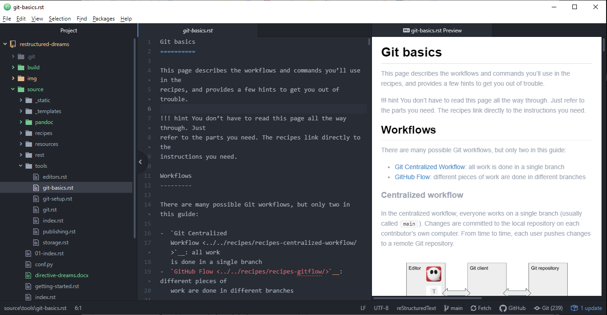
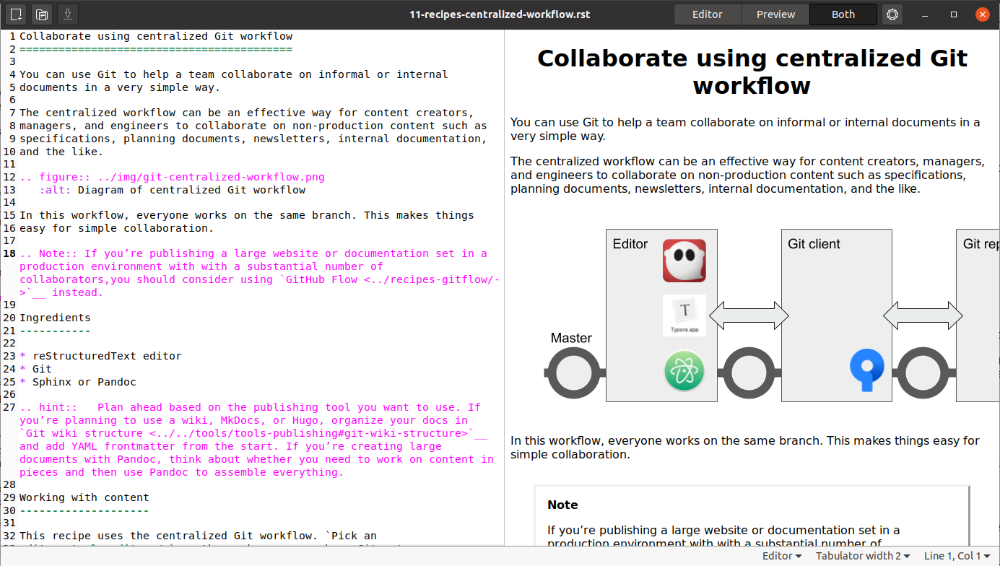
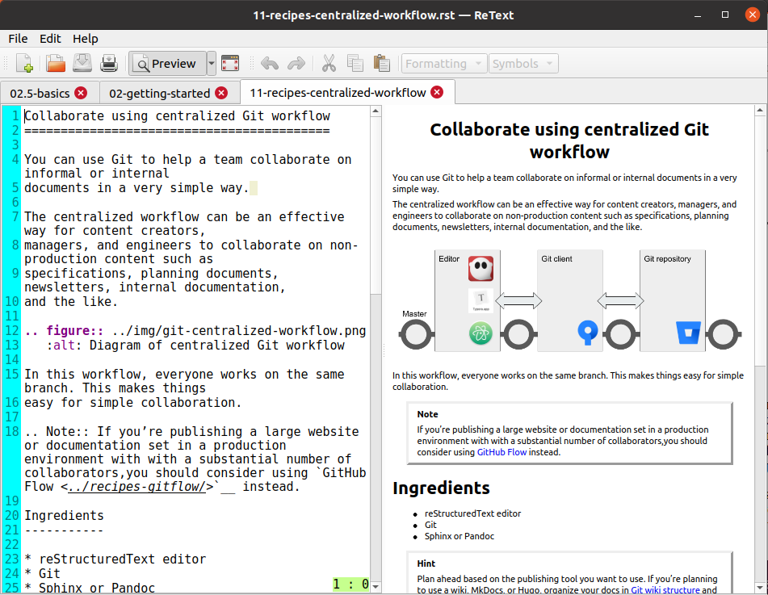

Editors
=======

.. toctree::
   :hidden:

Like other markup languages, reStructuredText works well with text editors and code editors, and a small number of purpose-built editors.

.. Hint:: 
   Atom is easy to install on any platform and there are packages available for
   reStructuredText (click **Packages > Settings View > Install Packages/Themes** 
   and then search). Atom also provides a Project view (directories and files) 
   and Git integration.

Code editors
------------
Code editors, while they are not designed specifically for reStructuredText, sometimes offer sophisticated packages to support reStructuredText editing and preview.

An advantage of a code editor is the ability to do things like jump to a specific line number or set text wrapping rules. Some editors let you manage your project in Git directly from the user interface. The following editors, among others, are worth a look:

- `Atom <https://atom.io/>`_
- `Sublime Text <https://www.sublimetext.com/>`_
- `Visual Studio Code <https://code.visualstudio.com/>`_

There are also various reStructuredText tools for `Eclipse <https://www.eclipse.org/>`_.

reStructuredText editors
------------------------

There are a few dedicated reStructuredText editors out there. Most editors offer a live preview with error messages to help you troubleshoot your reStructuredText as you write. My current favorite is ReText, which is simple but makes tables and images easy. An advantage of a dedicated reStructuredText editor is that some of them include support for editing tables and other syntactical features.

Formiko
^^^^^^^

`Formiko <https://github.com/ondratu/formiko#readme>`_ (Python) is a simple, capable editor that works with both reStructuredText and Markdown. It is no-frills, offering a few controls and preferences but not much more.

ReText
^^^^^^

`ReText <https://github.com/retext-project/retext/blob/master/README.md>`_ (Python) is a Markdown,  reStructuredText, and Textile editor with a few frills, including menu commands to help with tables and images.

Online editors
^^^^^^^^^^^^^^
* `Online reStructuredText editor <http://rst.ninjs.org/#>`_
* `Online Sphinx Editor <https://livesphinx.herokuapp.com/>`_
* `reStructuredText Viewer <http://rst.aaroniles.net/>`_

Text editors
------------
Because reStructuredText is just plain text, even the simplest text editor can be a capable tool. Some well-established text editors offer reStructuredText support:

- `BbEdit <https://www.barebones.com/products/bbedit/bb>`_
- `Emacs <https://www.gnu.org/software/emacs/>`_
- `JEdit <http://www.jedit.org/>`_
- `Notepad++ <https://notepad-plus-plus.org/>`_
- `Vim <https://www.vim.org/>`_

Installing a Python-based editor
----------------------------------------------------

On Linux, you can sometimes install Python-based programs the same way you install other apps. On macOS or
Windows, you'll need to open the terminal and use a program called ``pip``
(or sometimes ``pip3`` if you're using Python 3) that knows how to locate and install Python applications.

Here's how it looks on Windows:

::

  C:\Users\pconrad>pip install formiko
  Collecting formiko
    Downloading formiko-1.4.3-py3-none-any.whl (115 kB)
       |████████████████████████████████| 115 kB 2.2 MB/s
  Requirement already satisfied: docutils>=0.12 in c:\users\pconrad\appdata\local\programs\python\python38\lib\site-packages (from formiko) (0.16)
  Installing collected packages: formiko
  Successfully installed formiko-1.4.3

Once the installation process is complete, you can run the program (in this case, ``formiko``)
from the command line.

.. note::
   I've had mixed results with Python apps on different platforms. If you
   have trouble installing and using one Python app, try another.

Adding a shortcut in Windows
^^^^^^^^^^^^^^^^^^^^^^^^^^^^

In Windows, it's not difficult to add a taskbar shortcut for a python program.

#. Click the **Start** menu and type the name of the program you installed.

   .. image::../../img/formiko-start-menu.png

#. Click **Open file location** to view the program (in this case, ``formiko.exe``)
   in the File Explorer.

#. Drag the file to the taskbar.
